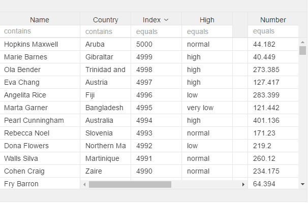

# v-filter

Add to enable filter in header input  
First param must always be field/property of collection you want to filter.  
Next are optional, you can add filter operator, value converter, and "onKeyDown" yo make grid filter on each key stroke, default if when you hit enter

For information about having 2 columns on same attribute to filter between a value, you will need to add a key, see sample under col-filter, values used in this attribute will be the same

```markup
<v-grid-col>
  <v-header-template>
    <input v-filter="field:name;operator:*;converter:myValueConverter;keydown:true">
    <p>Full Name</p>
  </v-header-template>
  <v-row-template>
    <input checked.bind="rowRef.name">
  </v-row-template>
</v-grid-col>
```

Operators:

```text
"="      : "equals"
"<=      : "less than or eq"
">="     : "greater than or eq"
"<"      : "less than"
">"      : "greater than"
"*"      : "contains"
"!="     : "not equal to"
"!*"     : "does not contain"
"*="     : "begins with"
"=*"     : "ends with"
```



