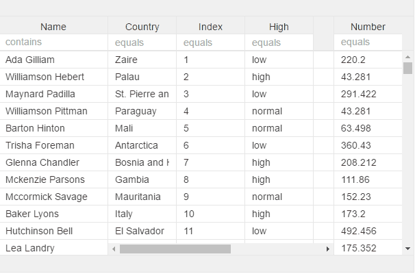
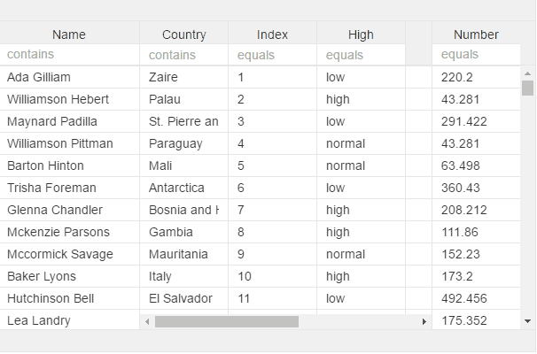
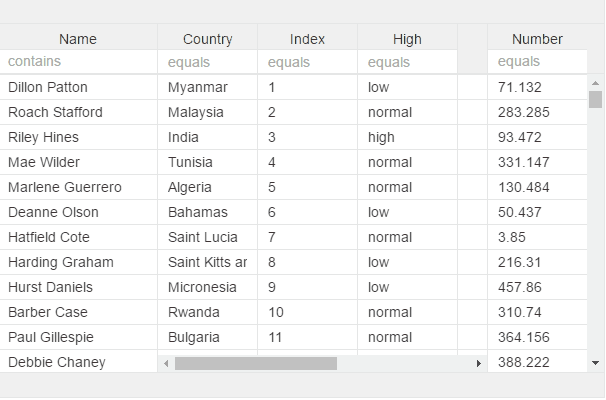

# v-menu

## filter

```text
v-menu="filterkey:something" 
// see col-filter for more info for now, used when having filter with between values, adn two columns
```



## sort

```text
v-menu="sort:attributeField"
```



## grouping

```text
v-menu="groupby:attributeField"
```



## Copypaste

col-row-menu="copypaste:attributeField"

todo, add picture

## hide

col-label-menu="hideshow:true" \(will try and use col-header-name, else its using the col-field with uppercase the first char todo, add picture

## mix

You can also mix

```text
v-menu="groupby:attributeField;sort:attributeField"
```


```text
v-menu="groupby:attributeField;sort:attributeField;filter:attributeField"
```


* todo add "hideshow:true" for hide/column chooser

