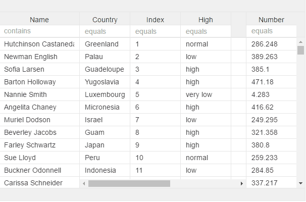

# v-sort

For adding sort icon and making the grid sort when header label is clicked

`asc` are optional, default is "true".

```markup
<v-grid-col col-width="120">
  <v-header-template>
    <p v-sort="field:name;asc:false;" >Full name</p>
  </v-header-template>
  <v-row-template>
    <input value.bind="rowRef.name">
  </v-row-template>
</v-grid-col>
```



