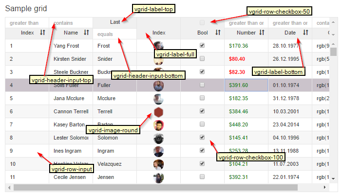

# checkbox

## Sample code from picture below

**checkbox**

```text
<v-grid-col col-width="70">
  <v-header-template>
    <input class="avg-row-checkbox-50" type="checkbox">
    <p class="avg-label-bottom">Bool</p>
  </v-header-template>
  <v-row-template>
    <input class="avg-row-checkbox-100" type="checkbox" checked.bind="rowRef.bool">
  </v-row-template>
</v-grid-col>
```

\(todo: replace picture, "vgrid-" needs to be "avg-"\) 

