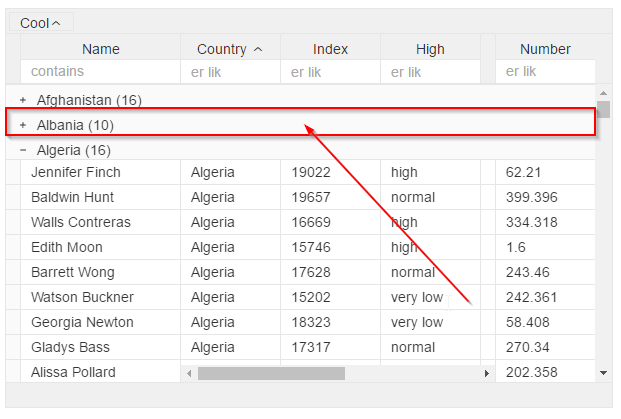

# &lt;v-grid-group-row&gt;

## Custom group row

For creating custom grouping row Place it inside grid element, just like the `<v-grid-col>` elements fro creating columns Rows are 100% wide

```text
<v-grid-group-row>
  <i click.delegate="changeGrouping(rowRef)">
    <svg class="icon" xmlns="http://www.w3.org/2000/svg" viewBox="0 0 16 16">
    <path show.bind="rowRef.__groupExpanded" d="M4.8 7.5h6.5v1H4.8z"/>
    <path show.bind="!rowRef.__groupExpanded" d="M7.4 4.8v2.7H4.7v1h2.7v3h1v-3h2.8v-1H8.5V4.8h-1z"/>
    </svg>
  </i>&nbsp;${rowRef.__groupName} (${rowRef.__groupTotal})
</v-grid-group-row>
```



