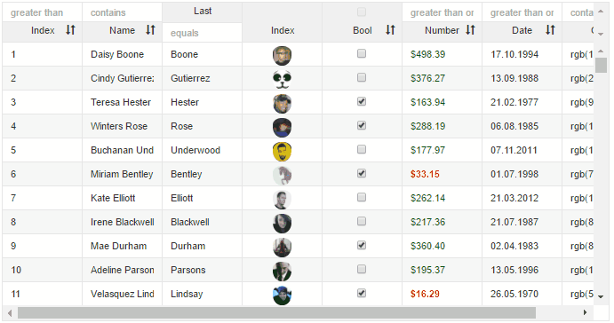

# ```<v-grid>``` Aurelia Plugin

Simple grid for displaying data

[Live Demo](https://aurelia-ui-toolkits.gitbooks.io/aurelia-v-grid-docs/content/chap02/live_demo_and_gistrun.html)

[Gitter channel](https://gitter.im/aurelia-ui-toolkits/aurelia-v-grid)

[Github Source](https://github.com/aurelia-ui-toolkits/aurelia-v-grid)



