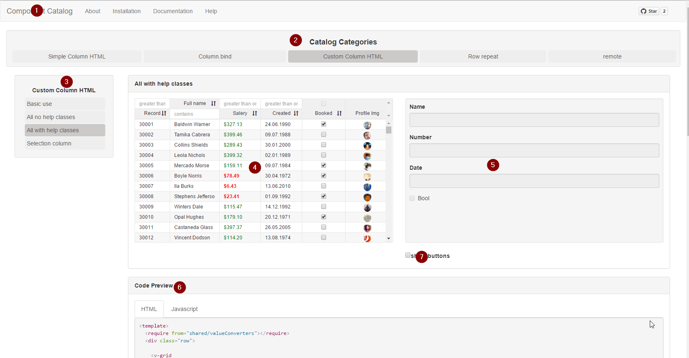

# Demo
This chapter covers how to get started with the demo. If you do not want to install anything yet you will find a demo link in the end of the chapter.

---

### How to get demo download and running:
> Im assuming you have npm/gulp installed, if not go to [aurelia.io](http://aurelia.io/docs.html#/aurelia/framework/1.0.0-beta.1.2.4/doc/article/a-production-setup) and follow the production setup guide first.

- 1: Download ```git clone https://github.com/aurelia-ui-toolkits/aurelia-v-grid```

- 2: Run ```npm install``` in under root folder and under "sample"

- 3: Run ```jspm install``` under root folder and under "sample"

- 4: Run ```gulp watch``` watch under the sample folder.


---

### Overview of the demo:



#### 1:Catalog

Click here to open the samples.

#### 2:Catalog Categories

Categories currently contain four variations on how to implement the grid. The last category "remote" shows how to use remote data.

#### 3:Categories Samples

Here you can find the samples for the selected category. For the first three categories the first samples show basically the same results. The Code preview pane shows how you can achieve these results by using different implementations.

"Basic-use" sample is the smallest amount of code needed to get some data on the screen.

"All" is using all features of the grid:
 * sorting
 * filters
 * context menus

"Selection column" shows how to make a column with check-boxes to control selection.

#### 4:Grid view

This shows the grid for the sample.

#### 5:Detail view

This shows the details of the selected row. It's data bound so you can edit the detail pane.

#### 6:Code view

Shows the HTML/JavaScript for the current sample.

#### 7:Collection buttons

Displays buttons to edit the collection the grid is displaying


