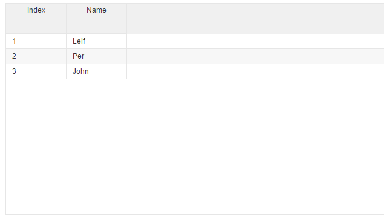

# Simple Column HTML

"Simple column HTML" is where we let the grid do the most of the work for us when it comes to adding css classes/markup. We only add ```<v-grid-col>``` inside the ```<v-grid>``` element with some attributes. Lets look on a small sample to get started.

First we will need to define the required variable in our class :
 *v-collection

```javascript
//page.js

export class Page {

 
  //collection to display
  myCollection = [
    {index:1, name:"Leif"}, 
    {index:2, name:"Per"},
    {index:3, name:"John"},
    ];

}
```

For the HTML we :
 * bind the variables we just created.
 * set row & header height.
 * add the ```v-grid-col``` with a ```col-field``` attribute for the field in collection we want.

To add filters/sorting to grid we will need to add more attributes.

```html
//page.html

<v-grid
   style="height:350px;width:500px"
   v-row-height="25"
   v-header-height="50"
   v-collection.bind=myCollection>
     <v-grid-col col-field="index"></v-grid-col>
     <v-grid-col col-field="name"></v-grid-col>
</v-grid>
```

This will then produced the grid you see in the picture below
Some features are enabled be default when using "simple column HTML"
* Drag drop headers
* re-size of columns
* Observing changes on from/to grid/current entity.



---
