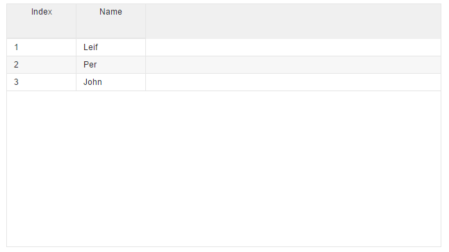

# Simple Column HTML
* [Gist demo with all enabled](https://gist.run/?id=fbd4e9f36d5eacd120dfac8184601f8d)

"Simple column HTML" is where we let the grid do the most of the work for us when it comes to adding css classes/markup. We only add ```<v-grid-col>``` inside the ```<v-grid>``` element with some attributes. Lets look on a small sample to get started.

First we will need to define the required variable in our class :
 *v-collection

```javascript
//page.js

export class Page {

 
  //collection to display
  myCollection = [
    {index:1, name:"Leif"}, 
    {index:2, name:"Per"},
    {index:3, name:"John"},
    ];

}
```

For the HTML we :
 * bind the variables we just created.
 * set row & header height.
 * add the ```v-grid-col``` with a ```col-field``` attribute for the field in collection we want.

To add filters/sorting to grid we will need to add more attributes.

```html
//page.html

<v-grid
   style="height:350px;width:500px"
   v-row-height="25"
   v-header-height="50"
   v-collection.bind=myCollection>
     <v-grid-col col-field="index"></v-grid-col>
     <v-grid-col col-field="name"></v-grid-col>
</v-grid>
```

This will then produced the grid you see in the picture below
Some features are enabled be default when using "simple column HTML"
* Drag drop headers
* re-size of columns
* Observing changes on from/to grid/current entity.



---

###All attributes we have available :
* col-width
* col-type
* col-field (REQUIRED)
* col-sort
* col-header-name
* col-filter
* col-filter-top
* col-css
* col-add-row-attributes
* col-add-filter-attributes


###More details about the attibutes:

##### col-width:
* default is 100
* sets the width of the column

```html
<v-grid-col col-width="105" col-field="name" ></v-grid-col>
```


---

##### col-type:
* default is "text"
* options are "selection", "checkbox" or "image"
 
```html
//image
<v-grid-col col-type="image" col-field="name"></v-grid-col>

//checkbox
<v-grid-col col-type="checkbox" col-field="name"></v-grid-col>

//default text
<v-grid-col col-field="name"></v-grid-col>

```
 
 
 ---
 
##### col-field: (REQUIRED)
* field/property of the data from collection


```html
//simple
<v-grid-col col-field="name"></v-grid-col>

//with aurelia build in attributes/valueConverter
<v-grid-col col-field="date | dateFormat & updateTrigger:'blur':'paste'"></v-grid-col>

```


---

##### col-sort:
* default is ""
* field name you want to do sorting on

```html
<v-grid-col  col-field="date" sort="date"></v-grid-col>

```


---


##### col-header-name:
* default is col-field where first letter is set to uppercase

```html

//this produces "Date" as header
<v-grid-col  col-field="date"></v-grid-col>

//descriptive header
<v-grid-col col-field="date" col-header-name="Created"></v-grid-col>

```

---

##### col-filter:
* see v-filter in chapter 04 for more details

```html
//sort date, greater than, with a value converter
<v-grid-col col-field="date" col-filter="date|>|dateFormat" col-filter-top="true"></v-grid-col>

```

---

##### col-filter-top:
* default is false
* use false/true to set filter above/under label in header

```html
<v-grid-col col-field="date" col-filter="date|>|dateFormat" col-filter-top="true"></v-grid-col>

//these are the same...
<v-grid-col col-field="date" col-filter="date|>|dateFormat" col-filter-top="false"></v-grid-col>
<v-grid-col col-field="date" col-filter="date|>|dateFormat"></v-grid-col>

```

----

##### col-css:
* css you want to add, usefull with on-row draw event for setting colors based on values

```html
 <v-grid-col col-field="number" col-css="color:${tempRef.numberColor}"></v-grid-col>

```

---

##### col-add-row-attributes:
* here you can put whatever you want and it gets added to row column, useful for own custom attributes

```html
<v-grid-col col-field="date" col-add-row-attributes="v-row-menu='date' v-key-move"></v-grid-col>

```
---

##### col-add-filter-attributes:
* here you can put whatever you want and it gets added header column, useful for own custom attributes

```html
<v-grid-col col-field="date" col-add-filter-attributes="v-header-menu='date'"></v-grid-col>
```
---

