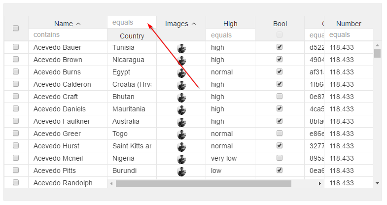

# col-filter

Adds filter to header, combine this with `col-filter-top="true"` if you dont want them under label



When using booleans you would need a valueConverter. Define it like this:

**Simple with operator "equal to"**

```html
col-filter="field: name;">
```

**  
Operator**

```html
col-filter="field: name; operator:*">
```

* '=':  equal
* '&lt;=': less than or equal to
* '&gt;=': greater than or equal to
* '&lt;':  less than
* '&gt;':  greater than
* '\*':  contains
* '!=': not equal to
* '!\*': does not contain
* '\*=': begin with
* '=\*': end with

**Convert**

```html
col-filter="field: isReleased; converter: bool;">
```

The `converter` property of `col-filter` takes the **name** of a value converter. It will internally be trandformed to \(in the above example\) `BoolValueConverter`.

**Trigger after on key down**

```html
col-filter="field: name; keydown:onKeyDown>
```

**2 columns with same attribute to have between values**

```
 <v-grid-col
    col-filter-menu="filter:index;filterkey:less"
    col-header-name="index"
    col-label-menu="sort:index" 
    col-width="100" 
    col-sort="field:index;asc:false" 
    col-filter="field:index;operator:<;key:less"
    col-field="index | numberFormatter"
    col-pin-left="true">
  </v-grid-col>

  <v-grid-col
    col-filter-menu="filter:index;filterkey:greater"
    col-header-name="index"
    col-label-menu="sort:index" 
    col-width="100" 
    col-sort="field:index;asc:false" 
    col-filter="field:index;operator:>;key:greater" 
    col-field="index | numberFormatter"
    col-pin-left="true">
  </v-grid-col>
```

Notice the "key" in col-filter and "filterkey" in col-filter-menu

For doing query with kode you will also need to include the key if you want the values to be inserted in the input

```
this.ds.query([{attribute: 'index', operator: '>', value: 5, key:'greater' }, {attribute: 'index', operator: '<', value: 10, key:'less' }]);
```


