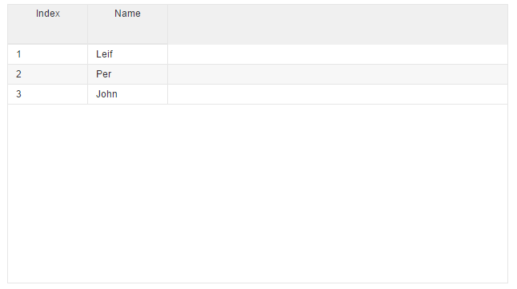

# Column.bind
* [Gist demo with all enabled](https://gist.run/?id=a3f31efc2caf188cacf0e68e37dc4a22)

Column.bind is almost the same as the "simple column HTML". Here you do not add the ```v-grid-col``` element to defined to columns, but you bind a array with properties to make the grid. Lets have a look on how to do this.

First we will set up or class. Like with "simple column HTML" we need to defined the required variables:
* v-collection

But unlike "simple HTML" we also need to defined 1 extra for the columns.
See class below.

```javascript
//page.js

export class Page {

 
  //collection to display
  myCollection = [
    {index:1, name:"Leif"}, 
    {index:2, name:"Per"},
    {index:3, name:"John"},
    ];
    
  //column setup  
  columnSetup = [
    {colField:"index"}
    {colField:"name"}
  ]

}
```

For the HTML we skip the ```v-grid-col``` element and bind out ```columnSetup``` we just created.

```html
//page.html

<v-grid
   style="height:350px;width:500px"
   v-row-height="25"
   v-header-height="50"
   v-collection.bind=myCollection
   v-columns.bind=columnSetup>
</v-grid>
```

This will then produce this grid you see below.
Like "simple column HTML", dragdrop/resize and observe are also enabled by default here.




###All attributes we have:
* colWidth
* colType
* colField (REQUIRED)
* colSort
* colHeaderName
* colFilter
* colFilterTop
* colCss
* colAddRowAttributes
* colAddFilterAttributes


###More details about fields inn the array:

##### colWidth:
* default is 100
* sets the width of the column

---

##### colType:
* default is "text"
* options are "selection", "checkbox" or "image"
 
---
 
##### colField: (REQUIRED)
* field/property of the data from collection

---

##### colSort:
* default is ""
* field name you want to do sorting on

---

##### colHeaderName:
* default is col-field where first letter is set to uppercase

---

##### colFilter:
* see v-filter in chapter 04 for more details

---

##### colFilterTop:
* default is false
* use false/true to set filter above/under label in header

---

##### colCss:
* css you want to add, usefull with on-row draw event for setting colors based on values

---

##### colAddRowAttributes:
* here you can put whatever you want and it gets added to row column, useful for own custom attributes

---

##### colAddFilterAttributes:
* here you can put whatever you want and it gets added header column, useful for own custom attributes

---

#####Sample array from demo:

```javascript
columnSetup = [
    {
      colField: "index",
      colWidth:80,
      colHeader:"Record",
      colFilter: "index|>=",
      colFilterTop: "index",
      colSort: true,
      colAddFilterAttributes: "v-header-menu='index'",
      colAddRowAttributes : "v-row-menu='index' v-key-move"
    }, {
      colField: "name",
      colWidth:120,
      colHeader:"Full Name",
      colFilterTop: false,
      colFilter: "name|*|onKeyDown",
      colSort: "name",
      colAddFilterAttributes: "v-header-menu='name'",
      colAddRowAttributes: "v-row-menu='name' v-key-move"
    }, {
      colField: "number | numberFormat & updateTrigger:'blur':'paste'",
      colWidth:100,
      colHeader:"Salery",
      colFilter: "number|>=",
      colFilterTop: true,
      colSort: "number",
      colAddFilterAttributes: "v-header-menu='number'",
      colAddRowAttributes: "v-row-menu='number' v-key-move",
      colCss:"color:${tempRef.numberColor};font-weight:${tempRef.numberFont}"
    }, {
      colField: "date | dateFormat & updateTrigger:'blur':'paste'",
      colWidth:100,
      colHeader:"Created",
      colFilter: "date|>|dateFormat",
      colFilterTop: true,
      colSort: "date",
      colAddFilterAttributes: "v-header-menu='date'",
      colAddRowAttributes: "v-row-menu='date' v-key-move"
    }, {
      colField: "bool",
      colWidth:105,
      colHeader:"Booked",
      colFilter: "bool",
      colFilterTop: true,
      colSort: "bool",
      colType: "checkbox",
      colAddFilterAttributes: "v-header-menu='bool'",
      colAddRowAttributes: "v-row-menu='bool' v-key-move"
    }, {
      colField: "images",
      colWidth:107,
      colHeader:"Profil img",
      colType: "image",
      colFilterTop:true,
      colAddFilterAttributes: "v-header-menu='images'",
      colAddRowAttributes: "v-row-menu='images' v-key-move tabindex='0'"
    }

```
