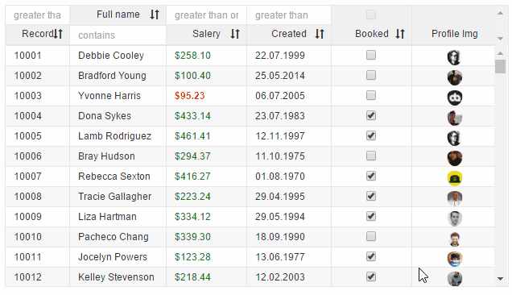

# v-drag-drop-col

Add it to one of the header elements you have to add drag/drop to column
Max 1 per column


```
<v-grid-col col-width="120">
  <v-header-template>
    <p v-drag-drop-col="title:Full Name; field:name">Full name</p>
    <input>
  </v-header-template>
  <v-row-template>
    <input value.bind="rowRef.name">
  </v-row-template>
</v-grid-col>
```
