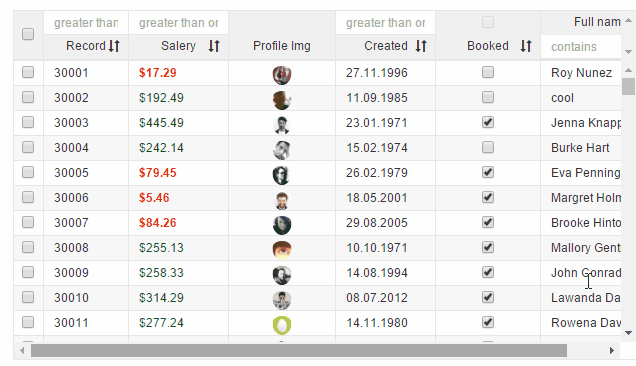

# v-image-fix

To be used with image elements in row, this will just help update the image faster/remove old as you scroll

```
<v-grid-col col-width="107">
  <v-header-template>
    <p>Profile Img</p>
  </v-header-template>
  <v-row-template>
    <image v-image-fix src.bind="rowRef.images"></image>
  </v-row-template>
</v-grid-col>
      ```
      
      
   