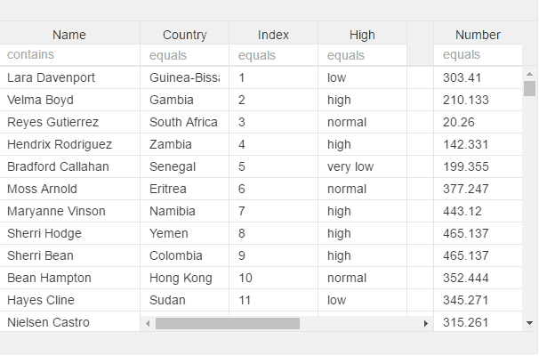

# v-menu


## filter


```
v-menu="filterkey:something" 
// see col-filter for more info for now, used when having filter with between values, adn two columns
```


## sort


```
v-menu="sort:attributeField"
```


## grouping


```
v-menu="groupby:attributeField"
```


## mix


You can also mix

```
v-menu="groupby:attributeField;sort:attributeField"
```


```
v-menu="groupby:attributeField;sort:attributeField;filter:attributeField"
```



* todo add "hideshow:true" for hide/column chooser


