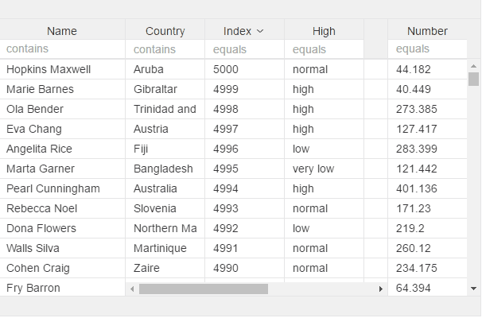

# v-resize-col

Add it to one of the header elements you have to add re-size to column.
Max 1 per column


```
<v-grid-col col-width="120">
  <v-header-template>
    <p>Full name</p>
    <input v-resize-col>
  </v-header-template>
  <v-row-template>
    <input value.bind="rowRef.name">
  </v-row-template>
</v-grid-col>
```
