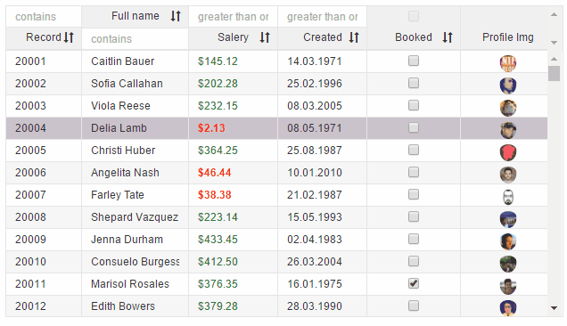

# v-row-menu
Add it to one of the row elements to add context menu

```
<v-grid-col col-width="120">
  <v-header-template>
    <p>Full name</p>
    <input>
  </v-header-template>
  <v-row-template>
    <input v-row-menu="name" value.bind="rowRef.name">
  </v-row-template>
</v-grid-col>
```

