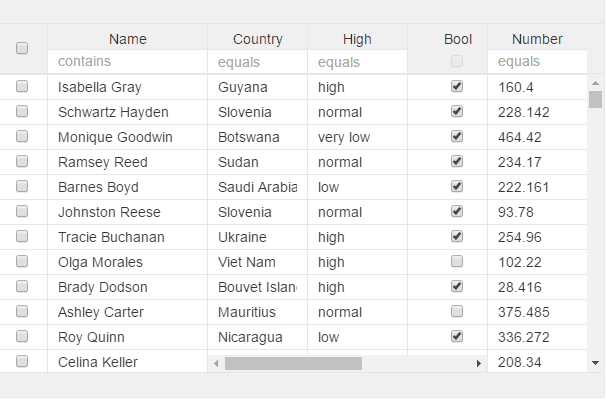

# v-selection
For manual selection
You also need to set "single" or "multiple" selection to grid and manual selection to true for this to be useful For more how to work with selection go to here: [selection functions](https://aurelia-ui-toolkits.gitbooks.io/aurelia-v-grid-docs/content/chap06/#selection-class)

Select all only selects all on visible rows, so if filtered or grouped this will only highlight


```html
<v-grid-col>
  <v-header-template>
    <input v-selection="header" type="checkbox">
  </v-header-template>
  <v-row-template>
    <input v-selection="row" type="checkbox"
  </v-row-template>
</v-grid-col>
```


if you dont make a selection column you highlight with the help of shift and control buttons

