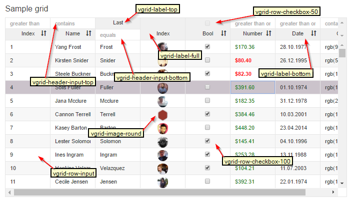

# Optional CSS classes for custom HTML
Here is the internal classes grid uses for when it generates the HTML cell markup for you in **"simple HTML"** and **"column.bind"**.
If you use custom HTML columns you can use these to help you get started. Or if you use **"simple HTML"** columns and combine it with 1 custom HTML and need it to look the same.

###classes

######checkboxes (header and rows):
* ```avg-row-checkbox-100``` (100% height)
* ```avg-row-checkbox-50```  (50% height)

######labels (headers):
* ```avg-label-bottom```
* ```avg-label-top```
* ```avg-label-full```

######image (rows):
* ```vgrid-image-round```


######inputs (rows):
* ```avg-row-input```


######inputs (header):
* ```avg-header-input-bottom```
* ```avg-header-input-top```


######Sample:  PS ! relace "vgrid" with "avg", picture not updated




**image**
```
<v-grid-col col-width="90">
  <v-header-template>
    <div style="height:50%"></div>
    <p class=" vgrid-label-bottom">Index</p>
  </v-header-template>
  <v-row-template>
    <image class="vgrid-image-round" v-image-fix v-row-menu="image" src.bind="rowRef.images"></image>
  </v-row-template>
</v-grid-col>
```

**text**
```
<v-grid-col col-width="100">
  <v-header-template>
    <input v-header-menu="number" class="vgrid-header-input-top" v-filter="number|>=" value.bind="tempRef.number">
    <p class="vgrid-label-bottom" v-sort="number">Number</p>
  </v-header-template>
  <v-row-template>
    <input v-row-menu="number" class="vgrid-row-input" 
      value.bind="rowRef.number | numberFormat  & updateTrigger:'blur':'paste'"
      css="color:${tempRef.numberColor};font-weight:${tempRef.numberFont}">
     </v-row-template>
</v-grid-col>
```

**selection (not is picture above)**
```
<v-grid-col col-width="30">
  <v-header-template>
    <input class="vgrid-row-checkbox-100" v-selection="header" type="checkbox">
  </v-header-template>
  <v-row-template>
    <input class="vgrid-row-checkbox-100" v-key-move v-selection="row" type="checkbox"
  </v-row-template>
</v-grid-col>

````