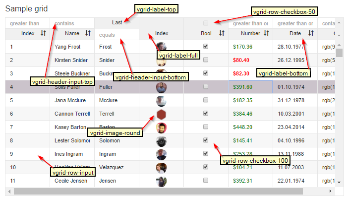

# input

####Sample code from picture below

**input**
```
<v-grid-col col-width="100">
  <v-header-template>
    <input class="avg-header-input-top" value.bind="tempRef.number">
    <p class="avg-label-bottom">Number</p>
  </v-header-template>
  <v-row-template>
    <input class="avg-row-input" 
      value.bind="rowRef.number">
     </v-row-template>
</v-grid-col>
```

(todo: replace picture, "vgrid-" needs to be "avg-")
