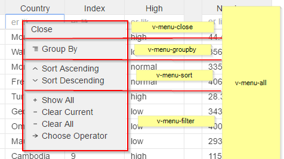
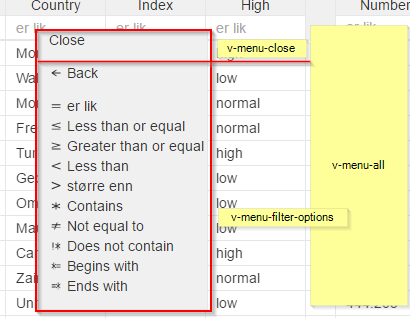

# `<v-grid-context>`

### custom menu

Custom html tag for replacing will be `v-grid-context`

```
<v-grid-context>
elements...
 </v-grid-context>
```

Possible parts inside context element is:

* `<v-menu-close>`
* `<v-menu-groupby>`
* `<v-menu-sort>`
* `<v-menu-filter>`
* `<v-menu-filter-options>`
* `<v-menu-chooser>`
* `<v-menu-chooser-options>`
* `<v-menu-all>`





