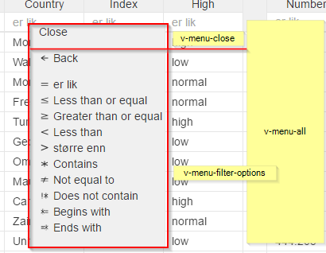

# ```<v-menu-filter-options>```




```
<ul if.bind="filterOptionsMenu" class="avg-menu__items">
    <li class="avg-menu__item">
    <p click.delegate="menuClick('filterOption','Back', $event)" class="avg-menu__link">
        <svg class="icon" xmlns="http://www.w3.org/2000/svg" viewBox="0 0 16 16">
           <path d="M8.7 4v1.2L5 7.5h8v1H5l3.7 2.2V12L3 8.4v-1L8.7 4z"/>
          </svg> ${this.menuStrings.back}
    </p>
    </li>
</ul>
<ul if.bind="filterOptionsMenu" class="avg-menu__items">
    <li class="avg-menu__item">
    <p click.delegate="menuClick('filterOption','=', $event)" class="avg-menu__link">
        <svg class="icon" xmlns="http://www.w3.org/2000/svg" viewBox="0 0 16 16">
            <path d="M13 7H3V6h10v1zm0 3H3V9h10v1z"/>
          </svg> ${this.menuStrings.equals}
    </p>
    </li>
    <li class="avg-menu__item">
    <p click.delegate="menuClick('filterOption','<=', $event)" class="avg-menu__link">
        <svg class="icon" xmlns="http://www.w3.org/2000/svg" viewBox="0 0 16 16">
            <path d="M13 10.3L3 7.5v-.7L13 4v1L5.3 7 13 9.3v1zm0 1.7H3v-1h10v1z"/>
          </svg> ${this.menuStrings.lessThanOrEqual}
    </p>
    </li>
    <li class="avg-menu__item">
    <p click.delegate="menuClick('filterOption','>=', $event)" class="avg-menu__link">
        <svg class="icon" xmlns="http://www.w3.org/2000/svg" viewBox="0 0 16 16">
            <path d="M13 7.4L3 10.2v-1l7.7-2L3 5V4l10 2.7v.7zm0 4.5H3v-1h10v1z"/>
          </svg> ${this.menuStrings.greaterThanOrEqual}
    </p>
    </li>
    <li class="avg-menu__item">
    <p click.delegate="menuClick('filterOption','<', $event)" class="avg-menu__link">
        <svg class="icon" xmlns="http://www.w3.org/2000/svg" viewBox="0 0 16 16">
           <path d="M3 8.5L13 12v-1.2L5 8l8-2.7V4L3 7.7v1z"/>
          </svg> ${this.menuStrings.lessThan}
    </p>
    </li>
    <li class="avg-menu__item">
    <p click.delegate="menuClick('filterOption','>', $event)" class="avg-menu__link">
        <svg class="icon" xmlns="http://www.w3.org/2000/svg" viewBox="0 0 16 16">
          <path d="M13 8L3 12v-1.4l8-3-8-3.2V3l10 4v1z"/>
          </svg> ${this.menuStrings.greaterThan}
    </p>
    </li>
    <li class="avg-menu__item">
    <p click.delegate="menuClick('filterOption','*', $event)" class="avg-menu__link">
        <svg class="icon" xmlns="http://www.w3.org/2000/svg" viewBox="0 0 16 16">
            <path d="M13 9.7l-.7 1L8.6 9v3H7.4V9l-3.6 1.7-.7-1L7 8 3 6.2l.7-1 3.7 2V4h1.3v3l3.6-1.7.7 1L9 8l4 1.7z"/>
          </svg> ${this.menuStrings.contains}
    </p>
    </li>
    <li class="avg-menu__item">
    <p click.delegate="menuClick('filterOption','!=', $event)" class="avg-menu__link">
        <svg class="icon" xmlns="http://www.w3.org/2000/svg" viewBox="0 0 16 16">
            <path d="M13 9.8H7.7l-1 2.2H5.7l1-2.2H2.8v-1h4L7.5 7H3V6h5l1-2H10l-1 2H13v1H9L8 9H13v1z"/>
          </svg> ${this.menuStrings.notEqualTo}
    </p>
    </li>
    <li class="avg-menu__item">
    <p click.delegate="menuClick('filterOption','!*', $event)" class="avg-menu__link">
        <svg class="icon" xmlns="http://www.w3.org/2000/svg" viewBox="0 0 16 16">
           <path d="M5 4V10H4V4h1zm5.5 0v3l2-1.7.5 1L10.7 8 13 9.8l-.4 1-2-2V12h-1l.2-3-2.2 1.7-.3-1L9.5 8 7.3 6.3l.3-1L9.8 7V4h.7zM5 11v1H4v-1h1z"/>
          </svg> ${this.menuStrings.doesNotContain}
    </p>
    </li>
    <li class="avg-menu__item">
    <p click.delegate="menuClick('filterOption','*=', $event)" class="avg-menu__link">
        <svg class="icon" xmlns="http://www.w3.org/2000/svg" viewBox="0 0 16 16">
          <path d="M5.2 4v3l-2-1.7-.2 1L5 8 3 9.8l.3 1 2-2V12h.6l-.2-3 2 1.8.2-1L6 8l2-1.8-.3-1-2 2L6 4H5zm3 2v1.2H13v-1H8.3zm0 2.8v1H13v-1H8.3z"/>
          </svg> ${this.menuStrings.beginsWith}
    </p>
    </li>
    <li class="avg-menu__item">
    <p click.delegate="menuClick('filterOption','=*', $event)" class="avg-menu__link">
        <svg class="icon" xmlns="http://www.w3.org/2000/svg" viewBox="0 0 16 16">
            <path d="M10.8 4v3l2-1.8.2 1L11 8l2 1.7-.3 1-2-2V12h-.6l.2-3.2-2 2-.3-1 2-2-2-1.6.3-1 2 2L10 4h.8zm-3 2v1H3V6h4.7zm0 2.7v1H3v-1h4.7z"/>
          </svg> ${this.menuStrings.endsWith}
    </p>
    </li>
</ul>
```


