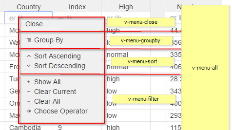

# ```<v-menu-groupby>```

```
<ul if.bind="groupbyMenu && !filterOptionsMenu" class="avg-menu__items">
    <li class="avg-menu__item">
    <p click.delegate="menuClick('groupby','groupby', $event)" class="avg-menu__link">
        <svg class="icon" xmlns="http://www.w3.org/2000/svg" viewBox="0 0 16 16">
         <path d="M3 4v1h10V4H3zm3.7 2.4v1H13v-1H6.8zm0 2.4v1H13v-1H6.8zm0 2.3v1H13v-1H6.8z"/>
          </svg> ${this.menuStrings.groupBy}
    </p>
    </li>
</ul>

```



