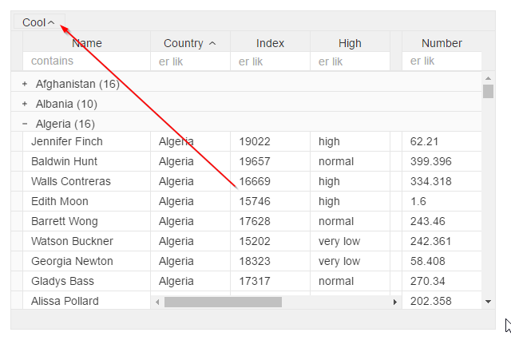

#```<v-grid-group-element>```

###Custom grouping element

For creating custom grouping element in panel
Place it inside grid element, just like the ```<v-grid-col>``` elements fro creating columns

Sample:
```
<v-grid-group-element>
  <div class="avg-grouping">  
    <p class="avg-grouping-element" v-sort="field.bind:field">${name} 
      <i><svg click.delegate="remove()" class="icon iconhidden" xmlns="http://www.w3.org/2000/svg" viewBox="0 0 16 16">
        <path d="M3 4l4.3 4L3 12h1.4L8 8.7l3.5 3.3H13L8.6 8 13 4h-1.5L8 7.3 4.4 4H3z"/>
      </svg></i>
    </p>
  </div>
</v-grid-group-element>
```

